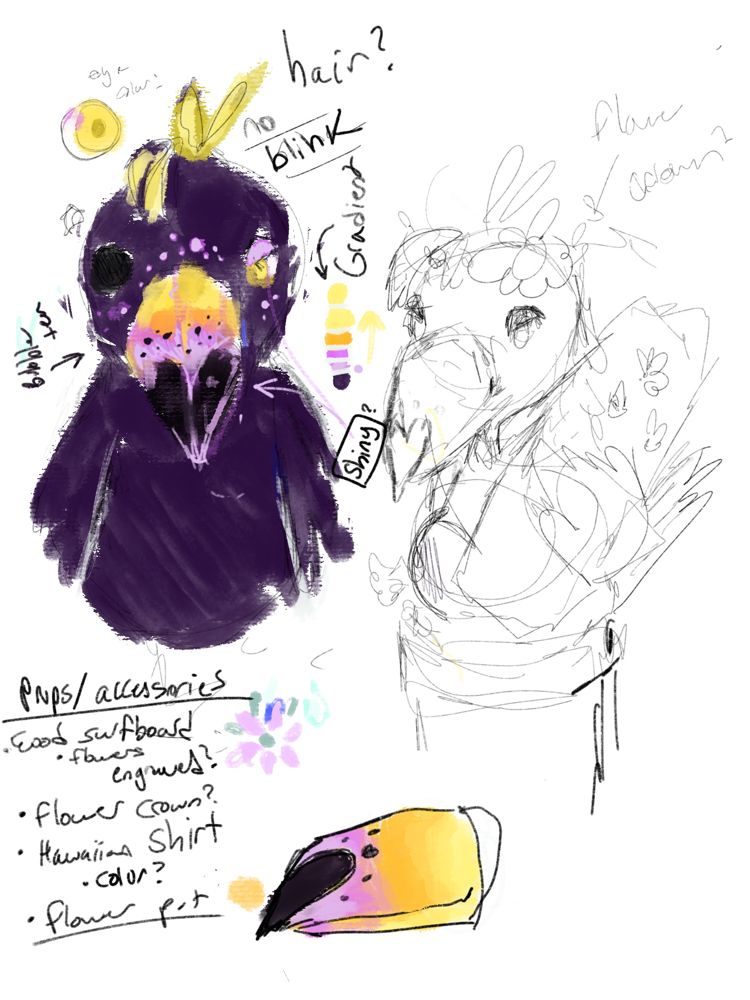
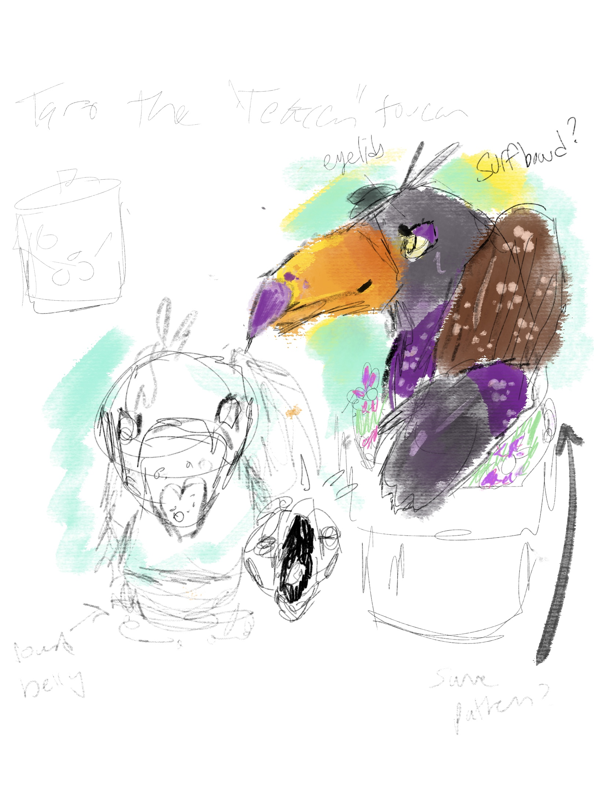

# Benjamin Miller
Hi! I am Benjamin Miller, a second year computer science student at **UC San Diego**!


### My Favorite Qoute
A Qoute that Speaks to me:
> Computer science is no more about computers than astronomy is about telescopes. - Edsger Dijkstra

### Recent Project
I recently wrote code that controls the mouth of an audio animatronic. A part of the code I am specifically proud of is:
```
while (1) {
    	if ((err = snd_pcm_readi(capture_handle, buffer, FRAMES)) < 0) {
        	fprintf(stderr, "\nRead error: %s\n", snd_strerror(err));
        	snd_pcm_prepare(capture_handle);
    	}
    	move_servo_based_on_amplitude(buffer, FRAMES);
}
```
[Link to the full repository](https://github.com/BenMiller0/teaAnimatronic/tree/main)

Here is some concept art of the bird:
 
 

### Here is a link to an MD file with all the fibinatic numbers I can calculate in my head:
[Fib](fib.md)

### Here are my top 5 programming langauges ranked:
1. C
2. C++
3. Java
4. ARM Assembly
5. Python

### Here are all the programming langauges I've ever written code in:
- System Verilog
- C
- C++
- Java
- ARM Assembly
- Python
- MatLab
- Scratch
- JavaScript
- Typescript
- Bash

### My bucket list:
- [x] (safely) Jump off a 900 foot tall building
- [x] Get certified in scuba diving
- [ ] Go to Japan
- [ ] Go to every Disney and Universal Park in the word

Important Section links
[My Recent Project](#Recent-Project).
[Top section](#Benjamin-Miller).
